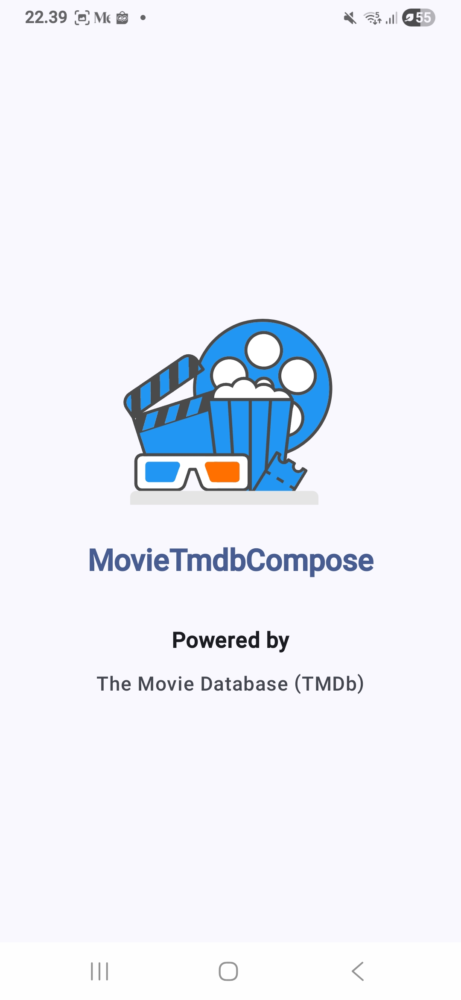
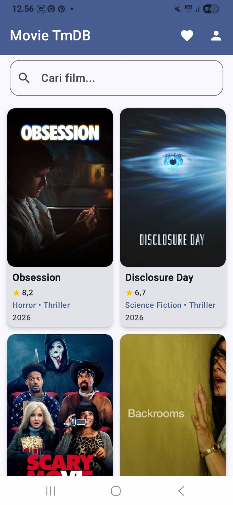
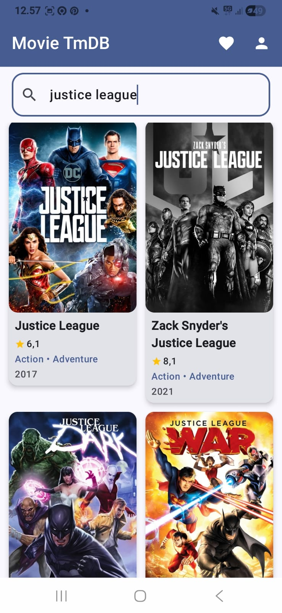
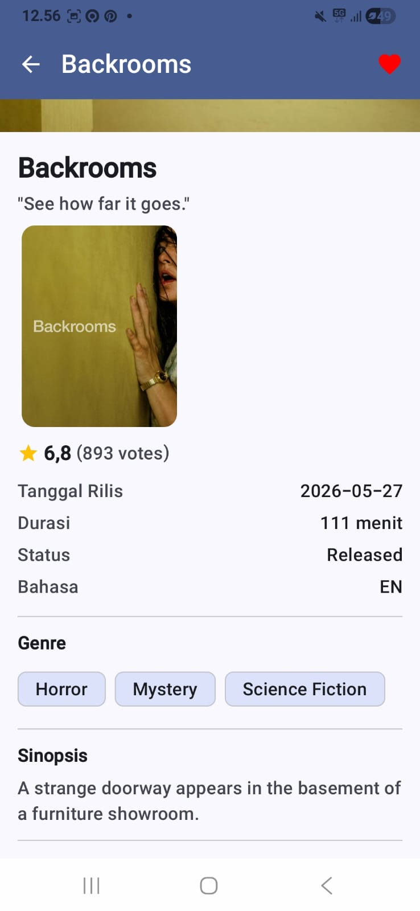
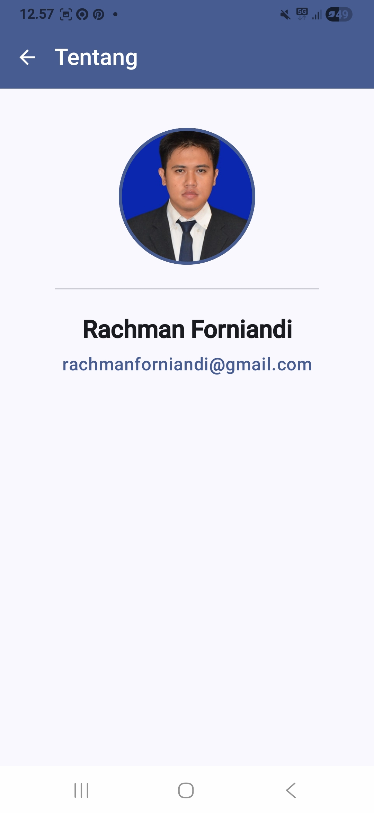

# 🎬 MovieTmDBCompose

Aplikasi katalog film Android yang dibangun sepenuhnya dengan **Jetpack Compose**.
Dikembangkan sebagai *Project Submission* kelas [Belajar Membuat Aplikasi Android dengan Jetpack Compose](https://www.dicoding.com/academies/445) dari Dicoding, sekaligus syarat kelulusan kelas tersebut.

> 💡 **Tertarik belajar Jetpack Compose?** Ikuti kelasnya langsung di [Dicoding](https://www.dicoding.com/academies/445), lalu kerjakan submission-nya dengan versi kamu sendiri. Repositori ini cocok sebagai **referensi belajar**, bukan untuk disalin utuh. Baca selengkapnya di [Belajar dari Repo Ini](#-belajar-dari-repo-ini).


---

## 📋 Daftar Isi

- [Fitur](#-fitur)
- [Yang Dipelajari](#-yang-dipelajari)
- [Tech Stack](#️-tech-stack)
- [Memulai](#-memulai)
- [Screenshot](#-screenshot)
- [Belajar dari Repo Ini](#-belajar-dari-repo-ini)

---

## ✨ Fitur

- 🚀 **Splashscreen** — Halaman pembuka saat aplikasi dijalankan
- 🏠 **Home** — Daftar film yang ditampilkan secara dinamis dan efisien menggunakan Lazy List
- 🔍 **Search Movie** — Pencarian film berdasarkan kata kunci
- 🎞️ **Detail Movie** — Informasi lengkap dari film yang dipilih
- 👤 **About User** — Halaman profil pengembang aplikasi
- 🧭 **Navigasi antarhalaman** menggunakan Navigation pada Jetpack Compose
- 🧪 **Testing** — Pengujian UI dan alur aplikasi (*end-to-end*) pada Jetpack Compose

<!-- Fitur Settings direncanakan menyusul. Tambahkan poin di sini setelah selesai. -->

---

## 📚 Yang Dipelajari

- Berkenalan dengan **Jetpack Compose**: alasan mempelajarinya dan tools untuk membuatnya.
- Memahami paradigma dan konsep dasar Jetpack Compose, seperti *declarative programming*, *composable function*, dan *recomposition*.
- Mempelajari berbagai macam **layout** dan **modifier** untuk membangun UI di Compose, serta konsep **Slot-based layout** agar UI bersifat *reusable*.
- Mengatur **State** pada Jetpack Compose, mengimplementasikan **State Hoisting** untuk membuat komponen *stateless*, memahami berbagai **Side Effect API**, dan mengetahui macam-macam lokasi manajemen state.
- Membuat aplikasi yang lebih kompleks dengan menampilkan data list yang banyak secara dinamis dan efisien menggunakan **Lazy List**.
- Mengimplementasikan **navigasi** antarhalaman pada Jetpack Compose.
- Memahami cara melakukan **testing** pada Jetpack Compose.
- Mengetahui cara menghubungkan Jetpack Compose dengan layout **XML** dan sebaliknya (*interoperability*).

---

## 🛠️ Tech Stack

| Kategori   | Teknologi                                  |
| ---------- | ------------------------------------------ |
| Bahasa     | Kotlin                                     |
| UI         | Jetpack Compose, Material Design           |
| Navigasi   | Navigation Compose                         |
| List       | Lazy List (`LazyColumn` / `LazyGrid`)      |
| Data       | TMDb (The Movie Database) API              |
| Testing    | Compose UI Test                            |

---

## 🚀 Memulai

### Prasyarat

- Android Studio versi terbaru
- Perangkat fisik atau emulator Android
- Akun [TMDb](https://www.themoviedb.org/) untuk membuat **API key milik kamu sendiri**

### Instalasi

1. **Clone repositori**

   ```bash
   git clone https://github.com/RachmanForniandi/MovieTmDBCompose.git
   ```

2. **Siapkan API key TMDb milik kamu sendiri.**
   Demi keamanan, API key **tidak disertakan** di repositori ini. Buat key di menu *Settings → API* pada akun TMDb kamu, lalu tambahkan ke berkas `local.properties` di root proyek:

   ```properties
   TMDB_API_KEY=isi_api_key_kamu_di_sini
   ```

   > ⚠️ `local.properties` sudah masuk `.gitignore` secara default pada proyek Android. Pastikan berkas ini **tidak pernah di-commit**.

3. **Buka** proyek di Android Studio, tunggu proses *Gradle sync* selesai, lalu **jalankan** aplikasi.

---

## 📸 Screenshot

| Splashscreen | Home | Search Movie |
| :---: | :---: | :---: |
|  |  |  |

| Detail Movie | About User |
| :---: | :---: |
|  |  |

---

## 🎓 Belajar dari Repo Ini

Kalau kamu sedang mempelajari Jetpack Compose, atau ingin memulainya, kelas [Belajar Membuat Aplikasi Android dengan Jetpack Compose](https://www.dicoding.com/academies/445) di Dicoding bisa jadi langkah awal yang baik. Materinya dibangun bertahap, mulai dari konsep dasar (*declarative UI*, *composable*, *recomposition*), layout dan modifier, *state* dan *state hoisting*, Lazy List, navigasi, hingga testing.

Di akhir kelas, kamu akan mengerjakan **submission project**. Di situlah semua materi diuji dan benar-benar melekat. Repositori ini adalah hasil submission saya, dan saya harap bisa membantu kamu.

**Gunakan repositori ini sebagai referensi belajar, jangan disalin keseluruhan.**

- ✅ Lihat repo ini untuk membandingkan pendekatan setelah kamu mencoba sendiri.
- ✅ Jadikan sebagai gambaran struktur proyek atau petunjuk saat kamu buntu di satu bagian.
- ✅ Pelajari alasan di balik kodenya, lalu tulis ulang dengan gayamu sendiri.
- ❌ Jangan salin proyek ini mentah-mentah untuk dikirim sebagai submission kamu.

Menyalin utuh memang lebih cepat, tetapi kamu kehilangan bagian yang paling berharga: mencoba, mengalami *error*, men-*debug*, lalu akhirnya paham. Proses itulah yang membuat kamu benar-benar mahir menulis UI dengan Compose. Semangat belajar! 🚀

---

## 📝 Tentang

*Project Submission* kelas **Belajar Membuat Aplikasi Android dengan Jetpack Compose** — Dicoding.
